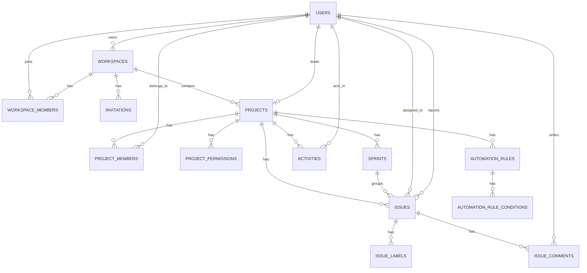

# JeerAI Backend Deep Dive

This README is intentionally written as a complete backend walkthrough for JeerAI. It is meant for someone who understands Node.js/Express style backends but is new to Spring Boot, Spring Security, Spring Data JPA, and Flyway.

If someone asks you in an interview:

- how this backend starts
- how authentication works
- how a request reaches the database
- why there are both `model` and `entity` classes
- why there are repository interfaces, in-memory implementations, and JPA adapters
- what every major file does
- how authorization is enforced
- how the schema is designed

this document is the answer.

## 1. What JeerAI Backend Is

JeerAI backend is a Spring Boot 3 application that exposes REST APIs for:

- authentication with JWT
- workspaces and workspace membership
- projects and project-level permission matrices
- issues, comments, activities, notifications
- invitations and email delivery
- analytics and automation rules

It supports two persistence styles behind the same service layer:

- in-memory repositories backed by `MockDataStore`
- PostgreSQL repositories backed by JPA entities and Flyway migrations

That is the core architectural idea of this codebase:

1. Controllers receive HTTP requests.
2. Services hold business rules.
3. Repository interfaces define storage contracts.
4. Repository implementations decide where data comes from.
5. JPA adapters map between domain `model` objects and database `entity` objects.

For a Node.js developer, think of it like this:

- `controller/` = Express route handlers
- `service/` = business logic layer
- `repository/` = data access abstraction
- `entity/` = ORM database classes
- `model/` = app/domain objects returned to the rest of the app
- `dto/` = request/response payload shapes
- `config/` = bootstrapping and framework wiring
- `security/` = auth middleware + token utility

## 2. Runtime Stack

- Java 17
- Spring Boot 3.5.11
- Spring Web
- Spring Security
- Spring Validation
- Spring Data JPA
- PostgreSQL
- Flyway
- Spring Mail
- JJWT
- Lombok
- H2 for tests

## 3. Top-Level Files

| File | Why it exists |
| --- | --- |
| `pom.xml` | Maven build file. Declares dependencies, Java version, Flyway plugin, compiler plugin, and Spring Boot packaging plugin. |
| `.env.properties` | Optional local config source imported by Spring. Intended place for `DB_URL`, `DB_USER`, `DB_PASSWORD`, `JWT_SECRET`, mail config, invite URL. |
| `mvnw`, `mvnw.cmd` | Maven wrapper scripts so the project can build without a globally installed Maven. |
| `README.md` | This document. |
| `src/main/resources/application.properties` | Main shared app configuration. Port, default profile, JWT, invite URL, and mail settings live here. |
| `src/main/resources/application-postgres.properties` | PostgreSQL-specific datasource, JPA, and Flyway settings loaded when the `postgres` profile is active. |
| `src/main/resources/db/migration/*.sql` | Flyway migrations. These define and evolve the database schema. |
| `src/test/resources/application.properties` | Test-only H2 configuration used by integration tests while still exercising Flyway and JPA mappings. |

## 4. Request Flow in Spring Boot

When a request hits the backend, the flow is:

1. Spring Boot starts from `JeeraiBackendApplication`.
2. `SecurityConfig` installs the JWT filter chain.
3. `JwtAuthenticationFilter` checks `Authorization: Bearer <token>`.
4. If valid, `CurrentUserProvider` can read the authenticated user from Spring Security context.
5. A controller method handles the route.
6. The controller calls a service.
7. The service applies business rules and authorization checks.
8. The service uses repository interfaces.
9. Active repository implementation persists/fetches data.
10. Result flows back as JSON.

In Express terms, `JwtAuthenticationFilter` is middleware, controllers are route handlers, and services are the real logic layer.

## 5. Architecture Layers

### 5.1 Boot layer

- `JeeraiBackendApplication` is the app entry point.

Method:

- `main(String[] args)`: starts Spring Boot with `SpringApplication.run(...)`.

### 5.2 Config layer

#### `config/DatabaseConfig.java`

Purpose:

- Enables JPA only when profile `postgres` is active.
- Scans `entity` package.
- Enables Spring Data repositories in `repository.jpa`.

Why important:

- It cleanly separates PostgreSQL/JPA mode from the in-memory mode.

Methods:

- none; it is annotation-driven wiring.

#### `config/SecurityConfig.java`

Purpose:

- Declares stateless JWT security.
- Permits public auth and health endpoints.
- Protects `/api/**`.

Methods:

- `securityFilterChain(HttpSecurity http)`: disables CSRF, enables CORS, sets stateless sessions, installs custom auth entry point, allows `/auth/**`, `/health`, `/api/invitations/validate`, `/api/invite/validate`, and requires auth for other `/api/**`.
- `passwordEncoder()`: exposes `BCryptPasswordEncoder`.

#### `config/WebConfig.java`

Purpose:

- Configures CORS for local frontend hosts and deployed Netlify frontend.

Methods:

- `addCorsMappings(CorsRegistry registry)`: registers CORS for `/api/**` and `/auth/**`.
- `registerCorsMapping(CorsRegistry registry, String pathPattern)`: internal helper that lists allowed origins, methods, headers, and credentials.

Current note:

- There is no startup seeder class in `config/` anymore.
- Demo/mock behavior is now represented by the `mock` profile repositories backed by `MockDataStore`, while the default runtime path is the `postgres` profile.

## 6. Security Layer

### `security/AuthenticatedUser.java`

Purpose:

- Small immutable record stored inside Spring Security context.

Fields:

- `userId`
- `email`

Methods:

- record accessors `userId()` and `email()` are auto-generated by Java record semantics.

### `security/CurrentUserProvider.java`

Purpose:

- Central helper used by services/controllers to read the logged-in user.

Methods:

- `getCurrentUserId()`: returns authenticated `userId`.
- `getCurrentUserEmail()`: returns authenticated `email`.
- `getAuthenticatedUser()`: reads Spring `SecurityContextHolder`, validates it is authenticated, and returns the `AuthenticatedUser` principal.

### `security/JwtAuthenticationEntryPoint.java`

Purpose:

- Converts authentication failures into JSON `401 Unauthorized` responses.

Methods:

- `commence(...)`: writes an `ErrorResponse` JSON body when auth fails.

### `security/JwtAuthenticationFilter.java`

Purpose:

- JWT middleware for every protected request.

Methods:

- `shouldNotFilter(HttpServletRequest request)`: skips `/auth/*` and `/health`.
- `doFilterInternal(...)`: validates bearer token, parses it into `AuthenticatedUser`, stores it in security context, or returns `401` on missing/expired/invalid token.

### `security/JwtUtil.java`

Purpose:

- Creates and parses JWT tokens.

Methods:

- `generateToken(String userId, String email)`: builds signed JWT with subject, userId, email, issuedAt, expiration.
- `parseToken(String token)`: validates token and converts claims into `AuthenticatedUser`.
- `buildSigningKey(String secret)`: validates JWT secret and creates HMAC key.
- `decodeKeyMaterial(String value)`: supports raw string secret, Base64, and Base64URL.
- `tryDecode(...)`: safe decoder helper.

## 7. Controller Layer

Controllers should stay thin in Spring Boot. In this project, they mostly delegate to services.

### `controller/AuthController.java`

Routes:

- `POST /auth/signup`
- `POST /auth/signup-with-invite`
- `POST /auth/login`

Methods:

- `signup(SignupRequest request)`: regular signup.
- `signupWithInvite(SignupWithInviteRequest request)`: signup flow tied to an invitation token.
- `login(LoginRequest request)`: validates credentials and returns token.

### `controller/WorkspaceController.java`

Routes:

- `POST /api/workspaces`
- `GET /api/workspaces`
- `GET /api/workspaces/owned`
- `GET /api/workspaces/onboarding`
- `GET /api/workspaces/{workspaceId}`
- `GET /api/workspaces/{workspaceId}/members`
- `GET /api/workspaces/{workspaceId}/dashboard-access`

Methods:

- `createWorkspace(...)`: creates workspace for current user.
- `getUserWorkspaces()`: returns workspaces current user belongs to.
- `getOwnedWorkspaces()`: returns workspaces current user owns.
- `getOnboardingStatus()`: returns whether onboarding is required.
- `getWorkspace(String workspaceId)`: returns one workspace with caller role.
- `getMembers(String workspaceId)`: validates membership then lists members.
- `getDashboardAccess(String workspaceId)`: explains whether user can enter that workspace dashboard.

### `controller/WorkspaceMemberController.java`

Routes:

- `PATCH /api/workspaces/{workspaceId}/members/{memberId}/role`
- `DELETE /api/workspaces/{workspaceId}/members/{memberId}`

Methods:

- `updateRole(...)`: owner-only role change endpoint.
- `removeMember(...)`: removes a member using owner/admin rules.

### `controller/ProjectController.java`

Routes:

- `GET /api/projects`
- `POST /api/projects`
- `GET /api/projects/{id}`
- `PATCH /api/projects/{id}`
- `GET /api/projects/{id}/permissions`
- `PATCH /api/projects/{id}/permissions`

Methods:

- `getAll()`: all accessible projects.
- `create(ProjectCreateRequest request)`: creates workspace-scoped project.
- `getById(String id)`: fetches one project.
- `update(String id, ProjectUpdateRequest request)`: updates project name/description.
- `getPermissions(String id)`: returns project permission matrix.
- `updatePermissions(String id, ProjectPermissionsDto permissions)`: updates matrix.

### `controller/IssueController.java`

Routes:

- `GET /api/issues`
- `GET /api/issues/{id}`
- `POST /api/issues`
- `PATCH /api/issues/{id}`
- `PATCH /api/issues/{id}/status`
- `GET /api/issues/{issueId}/comments`
- `POST /api/issues/{issueId}/comments`
- `POST /api/issues/simulate-random-update`

Methods:

- `getAll(String projectId)`: all accessible issues or one project’s issues.
- `getById(String id)`: fetch one issue.
- `create(IssueCreateRequest request)`: creates issue and side effects.
- `update(String id, JsonNode patch)`: partial update endpoint.
- `updateStatus(String id, IssueStatusUpdateRequest request)`: focused status update endpoint.
- `getComments(String issueId)`: list comments for issue.
- `addComment(String issueId, AddCommentRequest request)`: add comment and create activity/notifications.
- `simulateRandomUpdate(RandomUpdateRequest request)`: helper/demo endpoint that mutates an issue pseudo-randomly.

### `controller/InvitationController.java`

Routes:

- `POST /api/workspaces/{workspaceId}/invitations`
- `GET /api/workspaces/{workspaceId}/invitations`
- `GET /api/invitations/validate`
- `GET /api/invite/validate`
- `POST /api/invitations/{token}/accept`
- `POST /api/workspaces/{workspaceId}/invitations/{invitationId}/expire`
- `POST /api/workspaces/{workspaceId}/invitations/{invitationId}/revoke`

Methods:

- `createInvitation(...)`: create invite and send email/log.
- `getWorkspaceInvitations(...)`: list invites.
- `validateInvitation(String token)`: public token validation endpoint.
- `acceptInvitation(String token, AcceptInvitationRequest request)`: logged-in user accepts invite.
- `expireInvitation(...)`: admin manually expires invite.
- `revokeInvitation(...)`: admin manually revokes invite.

### `controller/ActivityController.java`

Routes:

- `GET /api/activities`
- `GET /api/activities/project/{projectId}`
- `POST /api/activities`
- `POST /api/activities/from-issue-update`

Methods:

- `getAll(String projectId)`: all visible activities or project activities.
- `getByProject(String projectId)`: explicit project activity list.
- `add(Activity activity)`: creates activity manually.
- `addFromIssueUpdate(ActivityFromIssueUpdateRequest request)`: utility endpoint that creates a plausible issue-related activity.

### `controller/NotificationController.java`

Routes:

- `GET /api/notifications`
- `PATCH /api/notifications/{id}/read`
- `PATCH /api/notifications/read-all`

Methods:

- `getAll()`: notifications for current user.
- `markRead(String id)`: marks one notification read.
- `markAllRead()`: marks all current user notifications read.

### `controller/AutomationRuleController.java`

Routes:

- `GET /api/automation-rules?projectId=...`
- `POST /api/automation-rules`
- `PATCH /api/automation-rules/{id}`
- `DELETE /api/automation-rules/{id}`
- `PATCH /api/automation-rules/{id}/toggle?enabled=...`

Methods:

- `getByProject(String projectId)`: list rules for a project.
- `create(AutomationRuleCreateRequest request)`: create rule.
- `update(String id, AutomationRuleUpdateRequest request)`: update mutable fields.
- `delete(String id)`: delete rule.
- `toggle(String id, boolean enabled)`: enable/disable rule quickly.

### `controller/AnalyticsController.java`

Route:

- `GET /api/analytics/projects/{projectId}`

Method:

- `getProjectAnalytics(String projectId)`: returns status counts, completion buckets, velocity by sprint, and workload by assignee.

### `controller/SprintController.java`

Route:

- `GET /api/sprints`

Method:

- `getAll(String projectId)`: all visible sprints or only one project’s sprints.

### `controller/UserController.java`

Routes:

- `GET /api/users`
- `GET /api/users/me`

Methods:

- `getAll()`: returns all users as `UserDto`.
- `getCurrentUser()`: returns current authenticated user.

### `controller/AiController.java`

Route:

- `POST /api/ai/message`

Method:

- `sendMessage(AiMessageRequest request)`: returns stubbed AI reply.

### `controller/HealthController.java`

Route:

- `GET /health`

Method:

- `health()`: returns `{ status: "ok", timestamp: ... }`.

### `controller/GlobalExceptionHandler.java`

Purpose:

- Central exception-to-HTTP mapping.

Methods:

- `handleEmailDelivery(...)`: returns `502`.
- `handleNotFound(...)`: returns `404`.
- `handleBadRequest(...)`: returns `400`.
- `handleForbidden(...)`: returns `403`.
- `handleUnauthorized(...)`: returns `401`.
- `handleValidation(...)`: returns structured field validation errors.
- `handleUnexpected(...)`: returns generic `500`.

## 8. Service Layer

The service layer is the real heart of the app.

### `service/AuthService.java`

Business role:

- signup, login, invited signup

Methods:

- `signup(SignupRequest request)`: checks duplicate email, hashes password, creates user, returns JWT.
- `login(LoginRequest request)`: loads user by email, compares BCrypt password hash, returns JWT.
- `signupWithInvite(SignupWithInviteRequest request)`: validates invite token, creates invited user, accepts invitation, returns JWT.
- `toAuthResponse(User user)`: internal mapper to `AuthResponse`.

### `service/UserService.java`

Business role:

- user lookup/creation utility used by many other services

Methods:

- `getAll()`: returns all users.
- `getById(String id)`: required user lookup or throws.
- `findByEmail(String email)`: normalized email lookup.
- `createUser(String name, String email)`: create without password hash.
- `createUser(String name, String email, String passwordHash)`: validates name/email and persists user.
- `findOrCreateUser(String userId, String name, String email)`: get by id or create by email.
- `findOrCreateUser(String userId, String name, String email, String passwordHash)`: same with password.
- `normalizeEmail(String email)`: lowercase-trim helper.

### `service/WorkspaceService.java`

Business role:

- workspace creation, listing, onboarding, dashboard access

Methods:

- `createWorkspace(CreateWorkspaceRequest request)`: trims name, prevents duplicate workspace names for same owner, saves workspace, adds owner membership.
- `getWorkspace(String workspaceId)`: returns workspace for current member.
- `listUserWorkspaces()`: maps memberships to workspace DTOs.
- `listOwnedWorkspaces()`: owner-only filter by current user id.
- `validateMembership(String workspaceId)`: asserts current user is member.
- `getOnboardingStatus()`: says whether user has zero workspaces.
- `getDashboardAccess(String workspaceId)`: tells frontend whether access is possible and why.
- `getWorkspaceModel(String workspaceId)`: raw model fetch.
- `attachProjectsToWorkspaceIfUnassigned(String workspaceId)`: migration/helper behavior for orphan projects.
- `toDto(Workspace workspace, WorkspaceRole role)`: internal mapper.

### `service/WorkspaceMemberService.java`

Business role:

- workspace membership CRUD and role enforcement

Methods:

- `addMember(...)`: creates membership if absent.
- `getMembers(String workspaceId)`: lists members as DTOs.
- `requireMembership(String workspaceId, String userId)`: membership guard.
- `requireCurrentMembership(String workspaceId)`: same for current user.
- `isWorkspaceMember(String workspaceId, String userId)`: boolean membership check.
- `updateRole(...)`: owner-only role update; forbids changing owner role from this endpoint.
- `removeMember(...)`: removes member with role rules; owner cannot be removed.
- `getMembershipsForUser(String userId)`: list memberships.
- `getMembershipsForCurrentUser()`: current-user memberships.
- `checkAdminAccess(String workspaceId, String userId)`: owner/admin gate.
- `checkOwnerAccess(String workspaceId, String userId)`: owner-only gate.
- `toDto(WorkspaceMember member)`: internal mapper enriched with user details.

### `service/WorkspaceAccessService.java`

Business role:

- shared authorization rules used by project/issue/activity/etc.

Methods:

- `requireWorkspaceReadAccess(String workspaceId)`: must belong to workspace.
- `requireWorkspaceAdminAccess(String workspaceId)`: must be owner/admin.
- `requireWorkspaceOwnerAccess(String workspaceId)`: must be owner.
- `requireProjectReadAccess(String projectId)`: project’s workspace must be accessible.
- `requireProjectIssueWriteAccess(String projectId)`: requires `CREATE_ISSUES` or `EDIT_ISSUES`.
- `requireProjectAdminAccess(String projectId)`: admin/owner on project workspace.
- `getAccessibleWorkspaceIds()`: set of current user workspace ids.
- `canCurrentUser(String projectId, ProjectPermissionKey permission)`: permission matrix check for current user.
- `getProject(String projectId)`: internal project lookup.
- `requireWorkspaceId(Project project)`: rejects projects not attached to a workspace.

### `service/ProjectPermissionService.java`

Business role:

- manages per-project permission matrix by role

Methods:

- `getPermissions(String projectId)`: returns resolved permission matrix.
- `updatePermissions(String projectId, ProjectPermissionsDto request)`: wipes old rows, persists new rows, returns resolved matrix.
- `isAllowed(String projectId, WorkspaceRole role, ProjectPermissionKey permission)`: checks one role/permission pair.
- `resolveMatrix(String projectId)`: overlays DB rows on top of default matrix.
- `defaultMatrix()`: owner/admin all true, member/viewer restricted defaults.
- `defaultPermissions(WorkspaceRole role)`: role switch helper.
- `allAllowed()`: every `ProjectPermissionKey` true.
- `memberDefaults()`: create/edit/view analytics true, delete/manage false.
- `viewerDefaults()`: only analytics true.

### `service/ProjectService.java`

Business role:

- project CRUD and permission matrix endpoints

Methods:

- `getAll()`: returns projects from accessible workspaces only.
- `create(ProjectCreateRequest request)`: validates workspace/name/key, requires workspace admin access, normalizes key, prevents duplicate key per workspace, sets current user as lead/member, saves project, seeds default permission matrix.
- `getById(String id)`: fetch with read access check.
- `update(String id, ProjectUpdateRequest request)`: requires `MANAGE_PROJECT`, updates name/description and `updatedAt`.
- `getPermissions(String projectId)`: read access then returns matrix.
- `updatePermissions(String projectId, ProjectPermissionsDto permissions)`: workspace admin access then delegates.
- `ensureManageProjectAccess(String projectId)`: internal permission guard.
- `getWorkspaceId(String projectId)`: internal helper for permission update path.
- `toDto(Project project)`: internal mapper.
- `toUserDto(User user)`: internal mapper.

### `service/IssueService.java`

Business role:

- issue creation, partial updates, comments, activities, notifications

Methods:

- `getAll(String projectId)`: issues for one project or all accessible workspaces.
- `getById(String id)`: fetch one issue with project read access.
- `create(IssueCreateRequest data)`: checks `CREATE_ISSUES`, derives issue key, sets reporter/current user, saves issue, creates activity, optionally creates assignment notification.
- `update(String id, JsonNode data)`: checks `EDIT_ISSUES`, patch-updates mutable fields, creates activities and notifications when status/priority/assignee changes.
- `updateStatus(String id, String status)`: focused status mutation plus activity and notification side effects.
- `getComments(String issueId)`: verifies issue exists and returns comments.
- `addComment(String issueId, AddCommentRequest request)`: checks `EDIT_ISSUES`, saves comment, creates activity, notifies assignee/reporter.
- `getCurrentActor()`: loads authenticated `User`.
- `createActivity(...)`: creates activity record tied to issue.
- `notifyAssigneeAndReporter(...)`: shared notification fan-out.
- `createNotification(...)`: persists notification if recipient exists.
- `humanize(String value)`: converts values like `in-progress` to `In Progress`.
- `simulateRandomUpdate(Double randomValue)`: picks writable issue and rotates status or priority for demo/testing.
- `readNullableString(...)`: JSON patch helper.
- `readNullableObject(...)`: JSON patch helper using `ObjectMapper`.
- `readNullableList(...)`: JSON patch helper for label arrays.

Important interview point:

This service contains side effects beyond the main update:

- update issue
- create activity log
- create notification(s)

That is a classic service-layer responsibility in layered architecture.

### `service/ActivityService.java`

Business role:

- activity read/write

Methods:

- `getAll()`: returns all activities visible to current user by filtering on project access.
- `getByProject(String projectId)`: returns project activities after access check.
- `add(Activity activity)`: manual activity insert with current user as actor.
- `addFromIssueUpdate(ActivityFromIssueUpdateRequest request)`: creates a pseudo-random status/assignment/comment activity for an issue.

### `service/NotificationService.java`

Business role:

- current user notification APIs

Methods:

- `getAll()`: fetches notifications by `recipientUserId`.
- `markRead(String id)`: only marks notification belonging to current user.
- `markAllRead()`: bulk mark current user notifications as read.

### `service/InvitationService.java`

Business role:

- workspace invitation lifecycle

Methods:

- `createInvitation(String workspaceId, CreateInvitationRequest request)`: admin-only, validates role/email/duplicates, creates secure token, saves invitation, delegates delivery.
- `getWorkspaceInvitations(String workspaceId)`: membership check, auto-expires stale invites, returns DTOs.
- `validateInvitation(String token)`: public token validation endpoint.
- `acceptInvitation(String token, AcceptInvitationRequest request)`: current logged-in user accepts matching-email invite and becomes workspace member.
- `acceptInviteForNewUser(String token, User user)`: signup-with-invite flow for brand new users.
- `validateInviteForSignup(String token)`: ensures invite is still valid and email not already registered.
- `expireInvitation(String workspaceId, String invitationId)`: admin forces `EXPIRED`.
- `revokeInvitation(String workspaceId, String invitationId)`: admin forces `REVOKED`.
- `expireInvitations(String workspaceId)`: automatic stale invite sweeper.
- `getInvitationByToken(String token)`: raw token lookup.
- `getPendingInvitation(String token)`: shared validation for status/expiration.
- `getPendingInvitationForCurrentUser(String token)`: ensures invite email matches authenticated user email.
- `getWorkspaceInvitation(String workspaceId, String invitationId)`: validates invite belongs to workspace.
- `isExpired(Invitation invitation)`: expiration check.
- `resolveExpiryDays(Integer expiresInDays)`: only allows 1 to 30 days, else defaults to 7.
- `generateSecureToken()`: 24-byte URL-safe token.
- `toDto(Invitation invitation, String workspaceName)`: response mapper.
- `buildInviteLink(String token)`: joins base URL and token.

### `service/AutomationRuleService.java`

Business role:

- CRUD for automation rules

Methods:

- `getByProject(String projectId)`: read access required.
- `create(AutomationRuleCreateRequest request)`: requires `MANAGE_PROJECT`, creates new rule.
- `update(String id, AutomationRuleUpdateRequest updated)`: loads rule, checks permission, updates supplied fields.
- `delete(String id)`: permission-checked delete.
- `toggle(String id, boolean enabled)`: quick enabled/disabled switch.
- `ensureManageProjectAccess(String projectId)`: internal guard.

### `service/AnalyticsService.java`

Business role:

- project dashboards

Methods:

- `getProjectAnalytics(String projectId)`: requires `VIEW_ANALYTICS`, computes status counts, workload, completion, velocity.
- `buildCompletionData(List<Issue> projectIssues)`: creates 4 weekly completion buckets using done issue count.
- `buildVelocityData(String projectId, List<Issue> projectIssues)`: counts done issues per sprint.

### `service/SprintService.java`

Business role:

- sprint list APIs

Methods:

- `getAll(String projectId)`: visible sprints globally or per project.

### `service/AiService.java`

Business role:

- currently a stub

Methods:

- `sendMessage(String message)`: returns `"AI response to: ..."` without calling any AI provider.

### Invitation delivery abstractions

#### `service/InvitationDeliveryService.java`

Method:

- `sendWorkspaceInvitation(Invitation invitation, Workspace workspace, String inviteLink)`: abstraction for invite delivery.

#### `service/NoOpInvitationDeliveryService.java`

Used when `app.mail.enabled=false`.

Method:

- `sendWorkspaceInvitation(...)`: logs invite details instead of sending email.

#### `service/SmtpInvitationDeliveryService.java`

Used when `app.mail.enabled=true`.

Methods:

- `sendWorkspaceInvitation(...)`: builds and sends plain-text email via `JavaMailSender`.
- `isPlaceholderPassword(String password)`: blocks accidental fake SMTP configs.
- `buildBody(...)`: creates email text body.

### Custom exception classes

- `AccessDeniedException`
- `BadRequestException`
- `EmailDeliveryException`
- `ResourceNotFoundException`
- `UnauthorizedException`

Purpose:

- semantic business exceptions used by services and mapped centrally by `GlobalExceptionHandler`.

Methods:

- each only exposes a constructor, except `EmailDeliveryException` which accepts `message` and `cause`.

## 9. DTO Layer

DTOs define API payload contracts. Most use Lombok, so there are no handwritten methods; getters/setters/constructors are generated.

### Request DTOs

| File | Fields | Used for |
| --- | --- | --- |
| `AcceptInvitationRequest.java` | `userId`, `name`, `passwordHash` | optional request body for invite acceptance path |
| `ActivityFromIssueUpdateRequest.java` | `issueId`, `randomValue` | utility activity generation |
| `AddCommentRequest.java` | `content`, `authorId` | create issue comment |
| `AiMessageRequest.java` | `message` | AI message endpoint |
| `AutomationRuleCreateRequest.java` | `name`, `projectId`, `trigger`, `conditions`, `action`, `enabled` | create automation rule |
| `AutomationRuleUpdateRequest.java` | `name`, `projectId`, `trigger`, `conditions`, `action`, `enabled` | patch automation rule |
| `CreateInvitationRequest.java` | `actorUserId`, `email`, `role`, `expiresInDays` | workspace invite creation |
| `CreateWorkspaceRequest.java` | `name`, `ownerUserId`, `ownerName`, `ownerEmail`, `ownerPasswordHash` | workspace creation |
| `IssueCreateRequest.java` | `title`, `status`, `priority`, `assignee`, `reporter`, `description`, `projectId`, `sprintId` | issue creation |
| `IssueStatusUpdateRequest.java` | `status` | status-only issue update |
| `LoginRequest.java` | `email`, `password` | login |
| `ProjectCreateRequest.java` | `name`, `key`, `description`, `workspaceId` | project creation |
| `ProjectUpdateRequest.java` | `name`, `description` | project patch |
| `RandomUpdateRequest.java` | `randomValue` | deterministic random-update simulation |
| `SignupRequest.java` | `name`, `email`, `password` | signup |
| `SignupWithInviteRequest.java` | `token`, `name`, `password` | invited signup |
| `UpdateWorkspaceMemberRoleRequest.java` | `actorUserId`, `role` | role updates |

### Response / transfer DTOs

| File | Fields | Used for |
| --- | --- | --- |
| `AiMessageResponse.java` | `reply` | AI reply |
| `AnalyticsDataDto.java` | `statusCounts`, `completionData`, `velocityData`, `workload` | project analytics bundle |
| `AuthResponse.java` | `token`, `user` | auth success response |
| `DashboardAccessDto.java` | `workspaceId`, `userId`, `hasWorkspace`, `accessible`, `onboardingRequired`, `reason` | dashboard gate result |
| `ErrorResponse.java` | `timestamp`, `status`, `message`, `path` | error body |
| `InvitationDto.java` | `id`, `workspaceId`, `workspaceName`, `email`, `role`, `status`, `token`, `inviteLink`, `expiresAt`, `createdAt` | invitation API response |
| `InviteValidationDto.java` | `token`, `workspaceId`, `workspaceName`, `email`, `role`, `userExists`, `status` | public invite validation |
| `OnboardingStatusDto.java` | `userId`, `onboardingRequired`, `workspaceCount`, `workspaces` | onboarding summary |
| `ProjectDto.java` | `id`, `key`, `name`, `description`, `lead`, `members`, `createdAt`, `updatedAt` | project API response |
| `ProjectPermissionsDto.java` | `projectId`, `permissions` | permission matrix response/update body |
| `UserDto.java` | `id`, `name`, `email` | safe user response |
| `WorkspaceDto.java` | `id`, `name`, `role`, `ownerId`, `createdAt` | workspace response |
| `WorkspaceMemberDto.java` | `id`, `workspaceId`, `user`, `role`, `joinedAt` | workspace member response |

### Nested analytics DTO classes

`AnalyticsDataDto` also contains:

- `StatusCount(status, count)`
- `CompletionBucket(week, completed)`
- `VelocityBucket(sprint, completed)`
- `WorkloadBucket(name, todo, inProgress, review, done)`

## 10. Domain Models vs JPA Entities

This is one of the most important architecture decisions in the project.

### `model/` package

These are plain domain objects used by services and controllers.

Examples:

- `User`
- `Project`
- `Issue`
- `Workspace`

They are simple and database-agnostic.

### `entity/` package

These are JPA ORM classes mapped to real tables.

Examples:

- `UserEntity` -> `users`
- `ProjectEntity` -> `projects`
- `IssueEntity` -> `issues`

They use JPA annotations like:

- `@Entity`
- `@Table`
- `@ManyToOne`
- `@ManyToMany`
- `@ElementCollection`

### Why keep both?

Because it prevents service code from being tightly coupled to JPA internals.

Benefits:

- easier switching between in-memory and PostgreSQL
- cleaner service layer
- explicit mapping boundary
- better control over lazy-loading and persistence concerns

For interview wording:

> The `model` package represents business-level domain objects. The `entity` package represents persistence-level database mappings. `JpaRepositoryMapper` converts between them, so services depend on repository contracts and domain models rather than directly on ORM classes.

## 11. Domain Model Files

Most `model` classes use Lombok `@Data`, `@NoArgsConstructor`, and `@AllArgsConstructor`, so they all have generated:

- getters
- setters
- no-args constructor
- all-args constructor
- `equals`
- `hashCode`
- `toString`

### `model/User.java`

Fields:

- `id`
- `name`
- `email`
- `passwordHash` (`@JsonIgnore`)
- `createdAt` (`@JsonIgnore`)

### `model/Workspace.java`

Fields:

- `id`
- `name`
- `ownerId`
- `createdAt`

### `model/WorkspaceMember.java`

Fields:

- `id`
- `workspaceId`
- `userId`
- `role`
- `joinedAt`

### `model/WorkspaceRole.java`

Enum values:

- `OWNER`
- `ADMIN`
- `MEMBER`
- `VIEWER`

### `model/Project.java`

Fields:

- `id`
- `key`
- `name`
- `description`
- `lead`
- `members`
- `createdAt`
- `updatedAt`
- `workspaceId`

### `model/ProjectPermission.java`

Fields:

- `id`
- `projectId`
- `role`
- `permission`
- `allowed`

### `model/ProjectPermissionKey.java`

Enum values:

- `CREATE_ISSUES`
- `EDIT_ISSUES`
- `DELETE_ISSUES`
- `MANAGE_PROJECT`
- `VIEW_ANALYTICS`

### `model/Issue.java`

Fields:

- `id`
- `key`
- `title`
- `status`
- `priority`
- `assignee`
- `reporter`
- `createdAt`
- `updatedAt`
- `description`
- `labels`
- `projectId`
- `sprintId`

### `model/IssueComment.java`

Fields:

- `id`
- `issueId`
- `author`
- `content`
- `createdAt`

### `model/Activity.java`

Fields:

- `id`
- `type`
- `actor`
- `targetId`
- `targetKey`
- `targetTitle`
- `detail`
- `createdAt`
- `projectId`

### `model/AppNotification.java`

Fields:

- `id`
- `recipientUserId`
- `title`
- `description`
- `read`
- `createdAt`
- `targetId`
- `type`

### `model/Sprint.java`

Fields:

- `id`
- `name`
- `projectId`
- `startDate`
- `endDate`
- `isActive`

### `model/Invitation.java`

Fields:

- `id`
- `workspaceId`
- `email`
- `role`
- `token`
- `status`
- `expiresAt`
- `createdAt`

### `model/InvitationStatus.java`

Enum values:

- `PENDING`
- `ACCEPTED`
- `EXPIRED`
- `REVOKED`

### `model/AutomationRule.java`

Fields:

- `id`
- `name`
- `projectId`
- `trigger`
- `conditions`
- `action`
- `enabled`
- `createdAt`

Nested class:

- `RuleValue(type, value)`

## 12. Entity Files and Table Mapping

Like the model classes, most entity classes use Lombok-generated getters/setters/constructors. Their main handwritten content is JPA annotations and field mapping.

| Entity file | Table | Important mapping details |
| --- | --- | --- |
| `UserEntity.java` | `users` | UUID PK, unique `public_id`, unique `email`, stores `password_hash`, `created_at` |
| `WorkspaceEntity.java` | `workspaces` | many-to-one owner -> `users` |
| `WorkspaceMemberEntity.java` | `workspace_members` | many-to-one workspace and user, unique `(workspace_id, user_id)`, role enum |
| `ProjectEntity.java` | `projects` | many-to-one lead, many-to-many members through `project_members`, many-to-one workspace |
| `ProjectPermissionEntity.java` | `project_permissions` | many-to-one project, enum role, enum permission, boolean allowed |
| `SprintEntity.java` | `sprints` | many-to-one project |
| `IssueEntity.java` | `issues` | assignee/reporter as many-to-one users, labels via `issue_labels`, many-to-one project and sprint |
| `IssueCommentEntity.java` | `issue_comments` | many-to-one issue and author |
| `ActivityEntity.java` | `activities` | many-to-one actor and project |
| `NotificationEntity.java` | `notifications` | stores `recipient_user_id` as plain string, not FK |
| `InvitationEntity.java` | `invitations` | many-to-one workspace, role/status enums, unique token |
| `AutomationRuleEntity.java` | `automation_rules` | embedded trigger/action values, ordered element collection conditions in `automation_rule_conditions` |

## 13. Repository Architecture

This app has three repository layers:

1. repository interfaces
2. in-memory implementations
3. JPA implementations

### Why this matters

Services depend on interfaces like `IssueRepository`, not directly on JPA. That means the same business logic can run on:

- in-memory seeded data
- PostgreSQL through JPA

### Repository interfaces

#### `UserRepository.java`

Methods:

- `findAll()`
- `findById(String id)`
- `findByEmail(String email)`
- `save(User user)`

#### `ProjectRepository.java`

Methods:

- `findAll()`
- `findById(String id)`
- `save(Project project)`

#### `IssueRepository.java`

Methods:

- `findAll()`
- `findByProjectId(String projectId)`
- `findById(String id)`
- `save(Issue issue)`
- `findCommentsByIssueId(String issueId)`
- `saveComment(IssueComment comment)`

#### `ActivityRepository.java`

Methods:

- `findAll()`
- `findByProjectId(String projectId)`
- `save(Activity activity)`

#### `SprintRepository.java`

Methods:

- `findAll()`
- `findByProjectId(String projectId)`
- `save(Sprint sprint)`

#### `NotificationRepository.java`

Methods:

- `findAll()`
- `findByRecipientUserId(String recipientUserId)`
- `save(AppNotification notification)`

#### `AutomationRuleRepository.java`

Methods:

- `findAll()`
- `findByProjectId(String projectId)`
- `findById(String id)`
- `save(AutomationRule rule)`
- `deleteById(String id)`

#### `WorkspaceRepository.java`

Methods:

- `findAll()`
- `findById(String id)`
- `save(Workspace workspace)`

#### `WorkspaceMemberRepository.java`

Methods:

- `findByWorkspaceId(String workspaceId)`
- `findByUserId(String userId)`
- `findById(String id)`
- `findByWorkspaceIdAndUserId(String workspaceId, String userId)`
- `save(WorkspaceMember member)`
- `deleteById(String id)`

#### `InvitationRepository.java`

Methods:

- `findByWorkspaceId(String workspaceId)`
- `findById(String id)`
- `findByToken(String token)`
- `findPendingByWorkspaceIdAndEmail(String workspaceId, String email)`
- `save(Invitation invitation)`

#### `ProjectPermissionRepository.java`

Methods:

- `findByProjectId(String projectId)`
- `saveAll(List<ProjectPermission> permissions)`
- `deleteByProjectId(String projectId)`

### In-memory implementations (removed)

Note: historical in-memory repository adapters and the `MockDataStore` previously used for local/demo runs have been removed from the source tree. The default runtime uses the `postgres` profile and JPA adapters. If you need seeded demo data, provide explicit DB seed scripts or test fixtures as noted in the Seed Data Behavior section.
- `saveInvitation(...)`, `findInvitationsByWorkspaceId(...)`, `findInvitationById(...)`, `findInvitationByToken(...)`
- `saveProjectPermission(...)`, `findProjectPermissionsByProjectId(...)`, `deleteProjectPermissionsByProjectId(...)`

### JPA repositories and adapters

There are two kinds of files under `repository/jpa/`.

#### A. Spring Data interfaces

These extend Spring Data JPA and talk directly to tables/entities:

- `UserJpaRepository.java`
- `ProjectJpaRepository.java`
- `IssueJpaRepository.java`
- `IssueCommentJpaRepository.java`
- `ActivityJpaRepository.java`
- `SprintJpaRepository.java`
- `NotificationJpaRepository.java`
- `AutomationRuleJpaRepository.java`
- `WorkspaceJpaRepository.java`
- `WorkspaceMemberJpaRepository.java`
- `InvitationJpaRepository.java`
- `ProjectPermissionJpaRepository.java`

Their purpose is equivalent to Sequelize/Prisma model accessors, but in Spring Data form.

#### B. Adapter classes

These implement the app’s repository interfaces and translate between `model` and `entity`.

Files and methods:

- `JpaUserRepositoryAdapter.java`
  - `findAll()`, `findById(...)`, `findByEmail(...)`, `save(...)`
- `JpaProjectRepositoryAdapter.java`
  - `findAll()`, `findById(...)`, `save(...)`
- `JpaIssueRepositoryAdapter.java`
  - `findAll()`, `findByProjectId(...)`, `findById(...)`, `save(...)`, `findCommentsByIssueId(...)`, `saveComment(...)`
- `JpaActivityRepositoryAdapter.java`
  - `findAll()`, `findByProjectId(...)`, `save(...)`
- `JpaSprintRepositoryAdapter.java`
  - `findAll()`, `findByProjectId(...)`, `save(...)`
- `JpaNotificationRepositoryAdapter.java`
  - `findAll()`, `findByRecipientUserId(...)`, `save(...)`
- `JpaAutomationRuleRepositoryAdapter.java`
  - `findAll()`, `findByProjectId(...)`, `findById(...)`, `save(...)`, `deleteById(...)`
- `JpaWorkspaceRepositoryAdapter.java`
  - `findAll()`, `findById(...)`, `save(...)`
- `JpaWorkspaceMemberRepositoryAdapter.java`
  - `findByWorkspaceId(...)`, `findByUserId(...)`, `findById(...)`, `findByWorkspaceIdAndUserId(...)`, `save(...)`, `deleteById(...)`
- `JpaInvitationRepositoryAdapter.java`
  - `findByWorkspaceId(...)`, `findById(...)`, `findByToken(...)`, `findPendingByWorkspaceIdAndEmail(...)`, `save(...)`
- `JpaProjectPermissionRepositoryAdapter.java`
  - `findByProjectId(...)`, `saveAll(...)`, `deleteByProjectId(...)`, `toModel(...)`, `toEntity(...)`

#### `JpaRepositoryMapper.java`

This is the most important persistence bridge in the project.

Purpose:

- converts between all domain `model` objects and JPA `entity` objects

Methods:

- `toModel(UserEntity entity)`, `toEntity(User model)`
- `toModel(ProjectEntity entity)`, `toEntity(Project model)`
- `toModel(WorkspaceEntity entity)`, `toEntity(Workspace model)`
- `toModel(WorkspaceMemberEntity entity)`, `toEntity(WorkspaceMember model)`
- `toModel(InvitationEntity entity)`, `toEntity(Invitation model)`
- `toModel(SprintEntity entity)`, `toEntity(Sprint model)`
- `toModel(IssueEntity entity)`, `toEntity(Issue model)`
- `toModel(IssueCommentEntity entity)`, `toEntity(IssueComment model)`
- `toModel(ActivityEntity entity)`, `toEntity(Activity model)`
- `toModel(NotificationEntity entity)`, `toEntity(AppNotification model)`
- `toModel(AutomationRuleEntity entity)`, `toEntity(AutomationRule model)`
- `toModel(AutomationRuleEntity.RuleValueEmbeddable value)`, `toEntity(AutomationRule.RuleValue value)`
- `resolveUser(User user)`
- `resolveProject(String projectId)`
- `resolveSprint(String sprintId)`
- `resolveIssue(String issueId)`
- `resolveWorkspace(String workspaceId)`
- `resolveWorkspaceByUuid(String workspaceId)`
- `resolveUserByPublicId(String userId)`
- `valueOrGenerated(String value, String prefix)`

Interview point:

`JpaRepositoryMapper` exists because the app uses string public ids like `user-1`, `proj-1`, `issue-1` in the domain layer, but real DB primary keys are UUIDs in the entity layer.

## 14. Full Source Structure

```text
src/main/java/com/jeerai/backend
├── JeeraiBackendApplication.java
├── config
│   ├── DatabaseConfig.java
│   ├── SecurityConfig.java
│   └── WebConfig.java
├── controller
│   ├── ActivityController.java
│   ├── AiController.java
│   ├── AnalyticsController.java
│   ├── AuthController.java
│   ├── AutomationRuleController.java
│   ├── GlobalExceptionHandler.java
│   ├── HealthController.java
│   ├── InvitationController.java
│   ├── IssueController.java
│   ├── NotificationController.java
│   ├── ProjectController.java
│   ├── SprintController.java
│   ├── UserController.java
│   ├── WorkspaceController.java
│   └── WorkspaceMemberController.java
├── dto
│   ├── AcceptInvitationRequest.java
│   ├── ActivityFromIssueUpdateRequest.java
│   ├── AddCommentRequest.java
│   ├── AiMessageRequest.java
│   ├── AiMessageResponse.java
│   ├── AnalyticsDataDto.java
│   ├── AuthResponse.java
│   ├── AutomationRuleCreateRequest.java
│   ├── AutomationRuleUpdateRequest.java
│   ├── CreateInvitationRequest.java
│   ├── CreateWorkspaceRequest.java
│   ├── DashboardAccessDto.java
│   ├── ErrorResponse.java
│   ├── InvitationDto.java
│   ├── InviteValidationDto.java
│   ├── IssueCreateRequest.java
│   ├── IssueStatusUpdateRequest.java
│   ├── LoginRequest.java
│   ├── OnboardingStatusDto.java
│   ├── ProjectCreateRequest.java
│   ├── ProjectDto.java
│   ├── ProjectPermissionsDto.java
│   ├── ProjectUpdateRequest.java
│   ├── RandomUpdateRequest.java
│   ├── SignupRequest.java
│   ├── SignupWithInviteRequest.java
│   ├── UpdateWorkspaceMemberRoleRequest.java
│   ├── UserDto.java
│   ├── WorkspaceDto.java
│   └── WorkspaceMemberDto.java
├── entity
│   ├── ActivityEntity.java
│   ├── AutomationRuleEntity.java
│   ├── InvitationEntity.java
│   ├── IssueCommentEntity.java
│   ├── IssueEntity.java
│   ├── NotificationEntity.java
│   ├── ProjectEntity.java
│   ├── ProjectPermissionEntity.java
│   ├── SprintEntity.java
│   ├── UserEntity.java
│   ├── WorkspaceEntity.java
│   └── WorkspaceMemberEntity.java
├── model
│   ├── Activity.java
│   ├── AppNotification.java
│   ├── AutomationRule.java
│   ├── Invitation.java
│   ├── InvitationStatus.java
│   ├── Issue.java
│   ├── IssueComment.java
│   ├── Project.java
│   ├── ProjectPermission.java
│   ├── ProjectPermissionKey.java
│   ├── Sprint.java
│   ├── User.java
│   ├── Workspace.java
│   ├── WorkspaceMember.java
│   └── WorkspaceRole.java
├── repository
│   ├── ActivityRepository.java
│   ├── AutomationRuleRepository.java
│   ├── InvitationRepository.java
│   ├── IssueRepository.java
│   ├── NotificationRepository.java
│   ├── ProjectPermissionRepository.java
│   ├── ProjectRepository.java
│   ├── SprintRepository.java
│   ├── UserRepository.java
│   ├── WorkspaceMemberRepository.java
│   ├── WorkspaceRepository.java
│   └── jpa
│       ├── ActivityJpaRepository.java
│       ├── AutomationRuleJpaRepository.java
│       ├── InvitationJpaRepository.java
│       ├── IssueCommentJpaRepository.java
│       ├── IssueJpaRepository.java
│       ├── JpaActivityRepositoryAdapter.java
│       ├── JpaAutomationRuleRepositoryAdapter.java
│       ├── JpaInvitationRepositoryAdapter.java
│       ├── JpaIssueRepositoryAdapter.java
│       ├── JpaNotificationRepositoryAdapter.java
│       ├── JpaProjectPermissionRepositoryAdapter.java
│       ├── JpaProjectRepositoryAdapter.java
│       ├── JpaRepositoryMapper.java
│       ├── JpaSprintRepositoryAdapter.java
│       ├── JpaUserRepositoryAdapter.java
│       ├── JpaWorkspaceMemberRepositoryAdapter.java
│       ├── JpaWorkspaceRepositoryAdapter.java
│       ├── NotificationJpaRepository.java
│       ├── ProjectJpaRepository.java
│       ├── ProjectPermissionJpaRepository.java
│       ├── SprintJpaRepository.java
│       ├── UserJpaRepository.java
│       ├── WorkspaceJpaRepository.java
│       └── WorkspaceMemberJpaRepository.java
├── security
│   ├── AuthenticatedUser.java
│   ├── CurrentUserProvider.java
│   ├── JwtAuthenticationEntryPoint.java
│   ├── JwtAuthenticationFilter.java
│   └── JwtUtil.java
└── service
    ├── AccessDeniedException.java
    ├── ActivityService.java
    ├── AiService.java
    ├── AnalyticsService.java
    ├── AuthService.java
    ├── AutomationRuleService.java
    ├── BadRequestException.java
    ├── EmailDeliveryException.java
    ├── InvitationDeliveryService.java
    ├── InvitationService.java
    ├── IssueService.java
    ├── NoOpInvitationDeliveryService.java
    ├── NotificationService.java
    ├── ProjectPermissionService.java
    ├── ProjectService.java
    ├── ResourceNotFoundException.java
    ├── SmtpInvitationDeliveryService.java
    ├── SprintService.java
    ├── UnauthorizedException.java
    ├── UserService.java
    ├── WorkspaceAccessService.java
    ├── WorkspaceMemberService.java
    └── WorkspaceService.java
```

Resources:

```text
src/main/resources
├── application.properties
├── application-postgres.properties
├── db/migration
│   ├── V1__initial_schema.sql
│   ├── V2__workspace_invitation_system.sql
│   ├── V3__backfill_user_password_hashes.sql
│   ├── V4__notification_recipient_user.sql
│   └── V5__project_permissions.sql
├── graphql/
├── static/
└── templates/
```

Tests:

```text
src/test/java/com/jeerai/backend
├── AuthControllerIntegrationTest.java
├── JeeraiBackendApplicationTests.java
└── WorkspaceServiceIntegrationTest.java
```

## 15. Database Schema and Data Model

The database is evolved by Flyway. These files are the source of truth:

- `V1__initial_schema.sql`
- `V2__workspace_invitation_system.sql`
- `V3__backfill_user_password_hashes.sql`
- `V4__notification_recipient_user.sql`
- `V5__project_permissions.sql`

### Table-by-table explanation

#### `users`

Columns:

- `id` UUID PK
- `public_id` unique external id like `user-1`
- `name`
- `email` unique
- `password_hash`
- `created_at`

Why both `id` and `public_id`?

- `id` is internal DB PK
- `public_id` is app-facing id used in domain objects and APIs

#### `workspaces`

Columns:

- `id`
- `name`
- `owner_id` -> `users.id`
- `created_at`

Meaning:

- top-level tenant/container in the app

#### `workspace_members`

Columns:

- `id`
- `workspace_id` -> `workspaces.id`
- `user_id` -> `users.id`
- `role`
- `joined_at`

Constraints:

- unique `(workspace_id, user_id)`

Meaning:

- many-to-many join between users and workspaces, but with extra role metadata

#### `projects`

Columns:

- `id`
- `public_id`
- `key`
- `name`
- `description`
- `lead_id` -> `users.id`
- `workspace_id` -> `workspaces.id`
- `created_at`
- `updated_at`

Meaning:

- project belongs to a workspace
- one lead user

#### `project_members`

Columns:

- `project_id`
- `user_id`

Meaning:

- many-to-many relation between project and users

#### `project_permissions`

Columns:

- `id`
- `project_id`
- `role`
- `permission`
- `allowed`

Constraint:

- unique `(project_id, role, permission)`

Meaning:

- per-project permission matrix by workspace role

#### `sprints`

Columns:

- `id`
- `public_id`
- `name`
- `project_id`
- `start_date`
- `end_date`
- `is_active`

Meaning:

- sprint belongs to one project

#### `issues`

Columns:

- `id`
- `public_id`
- `key`
- `title`
- `status`
- `priority`
- `assignee_id` -> `users.id`
- `reporter_id` -> `users.id`
- `created_at`
- `updated_at`
- `description`
- `project_id` -> `projects.id`
- `sprint_id` -> `sprints.id`

Meaning:

- issue belongs to project
- optionally belongs to sprint
- optionally has assignee
- has reporter

#### `issue_labels`

Columns:

- `issue_id`
- `label`

Meaning:

- normalized storage for issue labels list

#### `issue_comments`

Columns:

- `id`
- `public_id`
- `issue_id`
- `author_id`
- `content`
- `created_at`

Meaning:

- comment belongs to one issue and one author

#### `activities`

Columns:

- `id`
- `public_id`
- `type`
- `actor_id`
- `target_id`
- `target_key`
- `target_title`
- `detail`
- `created_at`
- `project_id`

Meaning:

- audit/activity feed entry linked to a project and actor

#### `notifications`

Columns:

- `id`
- `public_id`
- `recipient_user_id`
- `title`
- `description`
- `is_read`
- `created_at`
- `target_id`
- `type`

Meaning:

- user-scoped app notification

Note:

- `recipient_user_id` is stored as string public id, not FK to `users.id`

#### `invitations`

Columns:

- `id`
- `workspace_id`
- `email`
- `role`
- `token`
- `status`
- `expires_at`
- `created_at`

Meaning:

- invite somebody by email to a workspace with a future role

#### `automation_rules`

Columns:

- `id`
- `public_id`
- `name`
- `project_id`
- `trigger_type`
- `trigger_value`
- `action_type`
- `action_value`
- `enabled`
- `created_at`

Meaning:

- automation definition for a project

#### `automation_rule_conditions`

Columns:

- `rule_id`
- `position`
- `type`
- `value`

Meaning:

- ordered condition list belonging to automation rule

## 17. Flyway Migration Story

### `V1__initial_schema.sql`

Creates initial core tables:

- users
- projects
- project_members
- sprints
- issues
- issue_labels
- issue_comments
- activities
- notifications
- automation_rules
- automation_rule_conditions

### `V2__workspace_invitation_system.sql`

Adds:

- `password_hash`, `created_at` to users
- `workspaces`
- `workspace_members`
- `invitations`
- `workspace_id` to projects
- indexes for membership and invitation lookups

This is the migration that turns the app into a multi-workspace system.

### `V3__backfill_user_password_hashes.sql`

Backfills missing `password_hash` values with a default BCrypt hash.

### `V4__notification_recipient_user.sql`

Adds `recipient_user_id` to notifications and index for user inbox queries.

### `V5__project_permissions.sql`

Adds `project_permissions` table and project-level role/permission matrix.

## 18. Configuration Explained

### `application.properties`

Important keys:

- `spring.application.name=jeerai-backend`
- `server.port=5000`
- `spring.config.import=optional:file:./.env.properties`
- `spring.profiles.default=postgres`
- `app.security.jwt.secret`
- `app.security.jwt.expiration`
- `app.invitation.base-url`
- `app.mail.enabled`
- `app.mail.from`
- `spring.mail.*`

### `application-postgres.properties`

Important keys:

- `spring.datasource.url`
- `spring.datasource.username`
- `spring.datasource.password`
- `spring.datasource.driver-class-name`
- `spring.jpa.hibernate.ddl-auto=validate`
- `spring.jpa.database-platform=org.hibernate.dialect.PostgreSQLDialect`
- `spring.flyway.enabled=true`

Important interview point:

`ddl-auto=validate` means Hibernate does not create tables automatically. It only checks whether the schema matches entities. Actual schema evolution is owned by Flyway migrations.

That is the safer production approach.

## 19. Seed Data Behavior

The old `mock/mock-data.json` and `MockDataInitializer` startup seeder are no longer part of the codebase.

Current reality:

- the default runtime path is the `postgres` profile
- PostgreSQL schema is created/evolved by Flyway migrations
- the legacy in-memory `mock` profile and `MockDataStore` adapters have been removed from the main source tree; they are no longer provided by default
- integration tests use H2 with Flyway and JPA validation through `src/test/resources/application.properties`

Important note:

- if you want seeded demo data in the current codebase, it must come from explicit DB inserts, test setup, or future bootstrap code
- there is no startup class in `config/` that populates demo data automatically

## 20. Tests

### `AuthControllerIntegrationTest.java`

What it proves:

- signup returns JWT and user payload
- login flow works for the known integration-test credentials currently used by the suite
- protected API requires JWT

### `WorkspaceServiceIntegrationTest.java`

What it proves:

- authenticated user can create workspace without exception

### `JeeraiBackendApplicationTests.java`

What it proves:

- Spring context loads

## 21. Important Design Decisions You Should Be Able to Explain

### Why use services instead of putting logic in controllers?

Because controllers should only translate HTTP to method calls. Business rules like:

- duplicate workspace checks
- password hashing
- invite expiration
- permission checks
- notification side effects

belong in services so they are reusable and testable.

### Why repository interfaces plus adapters?

Because business logic should not care whether data comes from:

- memory
- PostgreSQL
- another persistence mechanism later

### Why separate `model` and `entity`?

Because ORM concerns and domain concerns are different. JPA entities contain persistence mapping details; models are cleaner for business logic and API transport.

### Why use Flyway if JPA entities already exist?

Because entity classes describe mappings, but production-safe schema changes should be explicit, versioned, and reviewable. Flyway gives that migration history.

### Why JWT and stateless auth?

Because the backend does not keep server-side sessions. Each request carries its authentication token, which scales well for frontend + API setups.

### Why permission matrix at project level?

Workspace membership alone is too coarse. A project needs finer rules like:

- viewers can see analytics
- members can create/edit issues
- only admins/owners can manage project settings

## 22. Real Behavior Summary by Feature

### Authentication

- signup hashes password with BCrypt
- login compares BCrypt hash
- JWT contains `userId` and `email`
- protected routes require bearer token

### Workspace system

- each workspace has one owner
- users can be owner/admin/member/viewer
- owner can reassign non-owner roles
- owner/admin can remove members with restrictions

### Project system

- project belongs to workspace
- project key must be unique inside workspace
- current user becomes project lead on create
- project gets default role-permission matrix on create, stored in `project_permissions`, and enforced by the service layer

### Issue system

- issue belongs to project, optionally sprint
- issue create/update checks permission matrix
- comments create activities and notifications
- status changes create activities and notifications
- assignee changes create assignment notifications

### Invitation system

- invites are email-based
- invite token is secure random
- invite can be `PENDING`, `ACCEPTED`, `EXPIRED`, `REVOKED`
- invite email must match authenticated user email during acceptance

### Notification system

- notifications are stored per recipient user id
- read state can be updated individually or in bulk

### Analytics

- status count from issue statuses
- completion buckets from done issues
- velocity from done issues grouped by sprint
- workload buckets by assignee and status

### Automation rules

- rules are stored, but there is no runtime automation engine yet
- this backend currently provides persistence and CRUD only

## 23. Current Limitations / Interview Honesty Points

These are worth mentioning honestly if asked what is incomplete:

- `AiService` is a stub and does not call a real model provider.
- automation rules are stored but not executed automatically.
- notification `recipient_user_id` is not a real FK to `users`.
- some request DTOs contain legacy fields not used anymore because auth now comes from JWT context.
- `simulateRandomUpdate` is a utility/demo endpoint, not a production workflow.
- tests cover startup/auth/basic workspace creation, but not the full business surface.

## 24. How to Explain JeerAI Backend in 60 Seconds

Use this answer:

> JeerAI backend is a layered Spring Boot application using JWT auth, workspace-based multi-tenancy, project-level authorization, and a repository abstraction that supports both profile-based in-memory repositories and PostgreSQL via JPA. Controllers stay thin, services own business rules, repository interfaces hide storage details, and JPA adapters map between domain models and entity classes. Database schema is managed through Flyway migrations rather than Hibernate auto-creation. Core features include auth, workspaces, invitations, projects, issues, comments, activities, notifications, analytics, an AI endpoint stub, and stored automation rules.

## 25. How to Run

Typical local setup:

1. Put secrets/config in `backend/jeerai-backend/.env.properties`
2. Start PostgreSQL if using `postgres` profile
3. Run:

```bash
./mvnw spring-boot:run
```

Windows:

```powershell
.\mvnw.cmd spring-boot:run
```

The app starts on port `5000`.

## 26. Final Mental Model

If you remember only one thing, remember this:

- `controller` receives HTTP
- `security` authenticates user
- `service` checks rules and permissions
- `repository` abstracts storage
- `entity` maps DB rows
- `model` represents business data
- `dto` shapes API payloads
- `migration` version-controls schema

That is the JeerAI backend architecture.

## 27. ER Diagram


